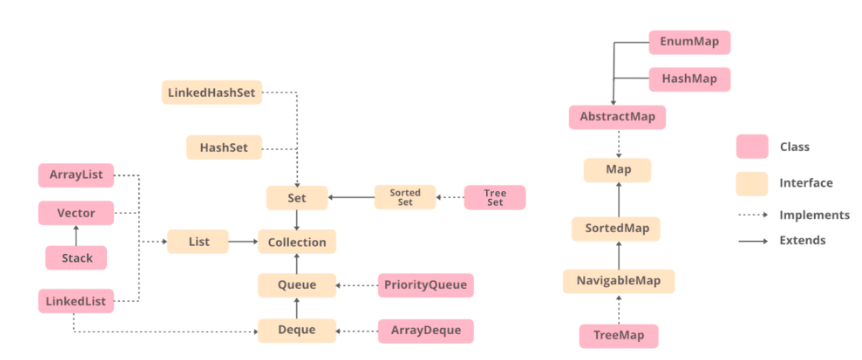

# Arrays vs Collections

--------------------

## Arrays.sort()

> Dual-Pivot QuickSort를 활용
- Pivot을 2개를 두고 3개의 구간을 만들어 퀵정렬을 진행
- 데이터가 랜덤일 시 퀵소트보다 성능 좋음

## Collections.sort()

> 합병정렬 + Tim 정렬 사용

- Tim : 삽입(Insertion) 정렬 + 합병(Merge) 정렬

## Difference

- 참조 지역성 원리(Local of Reference)
  - 동일한 값 또는 해당 값의 근처에 있는 스토리지 위치가 자주 엑세스 되는 특성
  - CPU의 캐싱 전략에 영향을 미침
    - CPU가 데이터를 엑세스 할때 해당 데이터만이 아니라 인접한 메모리에 있는 데이터 또한 캐시 메모리에 올려둠

- 동작 시간 : C * 시간복잡도 + a (C가 참조 지역성 원리에 영향)
  - Array : 메모리적으로 각 값들이 연속적인 주소를 가지고 있어 C가 낮음
  - Collection : 메모리적으로 산발적인 LinkedLink처럼 참조 인접성이 좋지 않고 C가 높음

- Memory usage
  - Arrays > Collections
- Performance
  - Arrays > Collections
- Variation
  - Arrays < Collections

